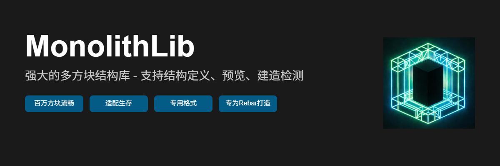

<p align="center">
  
</p>

<div align="center">
  
  
  
</div>

<p align="center">
  <a href="https://github.com/pylonmc/rebar" target="_blank">
    
  </a>
</p>

<div align="center">
  <h1>MonolithLib</h1>
  <p><strong>Rebar 多方块机器的现代 3D 打印方案</strong></p>
  <p>彻底解决巨型结构预览卡顿 · 完美支持楼梯等复杂方块状态 · 告别手写坐标</p>
</div>

<div align="center">
  <a href="#-核心理念"><strong>核心理念</strong></a> ·
  <a href="#-快速开始"><strong>快速开始</strong></a> ·
  <a href="#-rebar-集成指南"><strong>Rebar 集成</strong></a> ·
  <a href="#-玩家使用方法"><strong>玩家指南</strong></a> ·
  <a href="#-项目结构"><strong>架构</strong></a> ·
  <a href="./API_GUIDE.md"><strong>API 文档</strong></a>
</div>

<br/>

---

## 💡 核心理念：物理与逻辑的解耦

在使用 MonolithLib 之前，请先理解它的核心设计哲学。我们将多方块机器分成了两个完全独立的世界：

- **物理层（MonolithLib 负责）**：机器长什么样？由哪些方块组成？楼梯朝哪个方向？这叫 **Shape（形状）**。
- **逻辑层（Rebar 负责）**：机器能干什么？哪个方块算热源？这叫 **Component（组件）**。

MonolithLib **不干涉、不读取** Rebar 的组件代码。我们通过 **“相对坐标对齐”** 这唯一的桥梁，让两者完美咬合。

### 两个核心概念
1. **Shape（形状）**：纯粹的 3D 物理模型数据。从 `.mnb` 等文件加载而来，只包含相对坐标和精确的 `BlockData`。
2. **Blueprint（蓝图）**：`Shape` + 业务元数据（显示名、描述、所需材料清单、核心方块偏移量）。这是玩家和开发者直接交互的对象。

---

## ✨ 特性

<div align="center">
  <table>
    <tr>
      <td align="center" width="33%">
        <h3>🏗️ 精确的物理形状</h3>
        <p>原生支持楼梯朝向、半砖、红石方向等所有方块状态，彻底告别 Rebar 原版预览的状态丢失问题</p>
      </td>
      <td align="center" width="33%">
        <h3>👁️ 极致性能预览</h3>
        <p>类似投影MOD的逐层投影渲染，任何时刻仅计算玩家周身 7 格内的幽灵方块，支持百万级方块巨型结构</p>
      </td>
      <td align="center" width="33%">
        <h3>📦 告别手写坐标</h3>
        <p>支持导入 .schem/.litematic/.nbt，并导出为极速二进制 .mnb 格式，游戏内搭建，一键导出</p>
      </td>
    </tr>
  </table>
</div>

---

## 🚀 快速开始（开发者视角）

作为 Rebar 机械的开发者，你不需要再写几百行坐标定义，只需三步：

### 1. 添加依赖

```kotlin
repositories { mavenCentral() }
dependencies { compileOnly("top.mc506lw:monolithlib:1.0.0") }
```

### 2. 注册蓝图

```kotlin
class MyPlugin : JavaPlugin() {
    override fun onEnable() {
        // 1. 加载纯物理形状（你在游戏里用工具导出的 .mnb 文件）
        val shape = MonolithAPI.io.loadShape(File(dataFolder, "blueprints/blast_furnace.mnb"))
        
        // 2. 包装为蓝图
        val blueprint = Blueprint(
            id = "blast_furnace",
            shape = shape,
            meta = BlueprintMeta(
                name = text("高级高炉").color(NamedTextColor.GOLD),
                description = listOf(text("能够高温冶炼矿石"))
                // controllerOffset 默认为 0,0,0，如果导出时选了核心则自动携带
            )
        )
        
        // 3. 注册
        MonolithAPI.registry.register(blueprint)
    }
}
```

### 3. 编写 Rebar 代码（坐标契约）

去写你的 Rebar 机械类，**唯一的要求是：Rebar 代码里的偏移量，必须和 .mnb 文件里的相对坐标一模一样。**

```kotlin
class BlastFurnaceMultiblock : RebarSimpleMultiblock {
    override val components = mapOf(
        // .mnb 里 (0,0,0) 是核心，这里就写 (0,0,0)
        Pair(Vector3i(0, 0, 0), RebarMultiblockComponent(NamespacedKey("myplugin", "core"))),
        
        // .mnb 里 (1,0,0) 是朝西的熔炉，这里就精确匹配朝西的熔炉状态
        Pair(Vector3i(1, 0, 0), VanillaBlockdataMultiblockComponent(
            Material.FURNACE.createBlockData("[facing=west]")
        ))
    )
    // ... 你的机器逻辑
}
```

---

## 🔌 Rebar 集成指南：魔法开关

当玩家使用 MonolithLib 的自动建造（未来的加农炮/打印机）时，MonolithLib 会自动处理 Rebar 的组装触发，**开发者完全不需要手动调用 Rebar 的检测 API**。

**底层原理（你不需要管，但知道有好处）：**
1. MonolithLib 遍历 `.mnb`，用 Bukkit 原生 API 瞬间摆放完所有“外壳方块”（带精确状态）。
2. MonolithLib 找到核心方块位置，最后一步调用 `BlockStorage.placeBlock()` 放置 Rebar 核心方块。
3. Rebar 监听到放置事件，下一 tick 自动执行 `checkFormed()`，发现周围的方块状态完美匹配，机器瞬间启动！

---

## 🎮 玩家使用方法

### 命令结构（清晰明确）

MonolithLib 剔除了冗余的同义词命令，只提供最直觉的操作：

- `/ml list` - 查看所有可用蓝图
- `/ml info <蓝图ID>` - 查看蓝图详情与所需材料
- `/ml preview <蓝图ID>` - 开启分层投影预览
- `/ml build <蓝图ID>` - 执行自动建造（需消耗材料）

### 投影引导体验（类似 投影MOD 的分层投影渲染）

1. 玩家输入 `/ml preview blast_furnace`。
2. 脚下出现第一层结构的半透明幽灵方块（无论结构多大，只渲染身边 7 格，极其流畅）。
3. 玩家按照幽灵方块，手动把真实的熔炉、楼梯放置到对应位置。
4. 本层放完后，幽灵方块自动切换到下一层。
5. 放置到最后的核心方块时，MonolithLib 自动接管放置逻辑，**机器直接成型并启动**。

---

## 📁 项目结构

经过彻底的解耦重构，MonolithLib 现在拥有极高的内聚性和低耦合度：

```
MonolithLib/
├── api/                      # 🚪 对外门面（按意图划分）
│   ├── MonolithAPI.kt        #    统一入口
│   └── BlueprintAPI.kt       #    蓝图操作接口
│
├── core/                     # 🧱 纯粹的基础设施（零业务逻辑）
│   ├── model/                #    Shape、Blueprint 数据模型
│   ├── io/formats/           #    各种格式的读写器
│   ├── math/                 #    Matrix、Vector3i
│   └── transform/            #    坐标变换、方块状态旋转
│
├── feature/                  # 🛠️ 业务功能（可插拔）
│   ├── preview/              #    Ghost 渲染器、实体池
│   ├── builder/              #    建造执行器
│   ├── material/             #    材料统计
│   └── rebar/                #    Rebar 适配器 (仅处理核心放置)
│
├── validation/               # 🛡️ 验证层
│   ├── ValidationEngine.kt   #    验证引擎
│   └── predicate/            #    严格/松散/Rebar/旋转匹配器
│
├── lifecycle/                # ♻️ 生命周期管理
│   ├── BlueprintLifecycle.kt #    蓝图状态机
│   └── ChunkHandler.kt       #    区块加载卸载处理
│
└── internal/                 # ⚙️ 内部实现
    ├── command/              #    命令与 Tab 补全
    ├── listener/             #    事件监听
    └── mixin/                #    底层注入
```

---

## 🗺️ 路线图 (未来计划)

MonolithLib 的最终形态是成为 Rebar 生态中不可或缺的“现代化建造基础设施”：

- [ ] **投影打印机**：就是投影打印机。
- [ ] **蓝图加农炮**：类似机械动力，搭好加农炮多方块，放入材料和图纸，拉下开关轻松建造巨型机器。
- [ ] **图形化蓝图 GUI**：分类浏览、材料预览、一键预览的图形界面。
- [ ] **蓝图分享网络**：支持从在线仓库直接下载 `.mnb` 蓝图。

---

## 🛠️ 构建

```bash
git clone https://github.com/mc506lw/MonolithLib.git
cd MonolithLib
./gradlew build
```

---

## 📄 许可证

本项目采用 MIT 许可证 - 详见 [LICENSE](./LICENSE) 文件。

<div align="center">
  <p>如果 MonolithLib 拯救了你写 Rebar 坐标的时间，请给一个 ⭐️ 支持一下！</p>
</div>